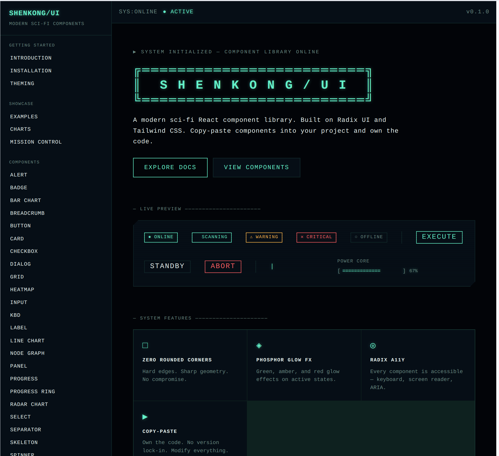

# SHENKONG/UI

> Modern Sci-Fi / Cassette Futurism UI component library for React.

A collection of multiple copy-paste components styled in a phosphor-screen terminal aesthetic. Dark backgrounds, green primary glows, monospace typography. Compatible with the **shadcn CLI** — install any component with one command.

---




---

## Quick Start (shadcn CLI)

**1. Init shadcn** (skip if already set up):
```bash
npx shadcn@latest init
```

**2. Add the shenkong-ui registry** to your `components.json`:
```json
{
  "registries": {
    "shenkong-ui": "https://shenkong-ui.dev/r"
  }
}
```

**3. Copy `globals.css`** from this repo into your project and import it:
```css
/* src/index.css */
@import './styles/globals.css';
```

**4. Add components:**
```bash
npx shadcn@latest add @shenkong-ui/button
npx shadcn@latest add @shenkong-ui/panel @shenkong-ui/badge @shenkong-ui/alert
npx shadcn@latest add @shenkong-ui/dialog @shenkong-ui/toast @shenkong-ui/select
```

**5. Use:**
```jsx
import { Button } from '@/ui/button'

export function MyPage() {
  return <Button variant="EXEC">INITIATE</Button>
}
```

---

## Components (16)

| Component | Description |
|---|---|
| **Button** | EXEC / OUTLINE / GHOST / DANGER variants |
| **Badge** | ACTIVE / SCANNING / WARNING / CRITICAL / OFFLINE |
| **Alert** | STATUS / WARNING / CRITICAL / INFO inline blocks |
| **Panel** | Corner-notch container with header/content/footer |
| **Spinner** | SM / MD / LG animated loader |
| **Separator** | Horizontal / vertical with optional label |
| **Progress** | Linear bar with label and percentage |
| **Checkbox** | Green checked state with optional label |
| **Switch** | Amber (off) → green (on) toggle |
| **Input** | Text input with label, prefix, error states |
| **Textarea** | Multi-line input with label and error |
| **Select** | Dropdown with groups, labels, separators |
| **Dialog** | Modal with backdrop blur and green header |
| **Tabs** | Green underline active tab |
| **Tooltip** | Fade + zoom. Requires `TooltipProvider` |
| **Toast** | STATUS / WARNING / CRITICAL / INFO via `useToast` |

---

## Manual Install (no shadcn)

1. Install deps:
```bash
npm install @radix-ui/react-slot @radix-ui/react-checkbox @radix-ui/react-select \
  @radix-ui/react-switch @radix-ui/react-dialog @radix-ui/react-tabs \
  @radix-ui/react-tooltip @radix-ui/react-toast @radix-ui/react-progress \
  @radix-ui/react-separator class-variance-authority clsx tailwind-merge

npm install -D vite
```

2. Configure Vite path alias (`@/*` → `src/*`) and import `globals.css`.

3. Copy any `src/ui/{name}/{name}.jsx` file into your project.

See the **Installation** page in the docs for the full step-by-step.

---

## Local Development

```bash
npm install
npm run dev          # docs site at http://localhost:5173
npm run build        # builds registry + docs site
npm run build:registry  # regenerate public/r/*.json only
```

---

## Stack

- React 19 + JavaScript + Vite
- Tailwind CSS v4 (CSS-first config via `@theme {}`)
- Radix UI primitives (headless)
- class-variance-authority for variant logic
- shadcn Open Registry format for CLI distribution
